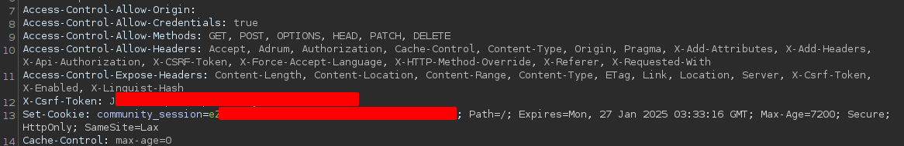
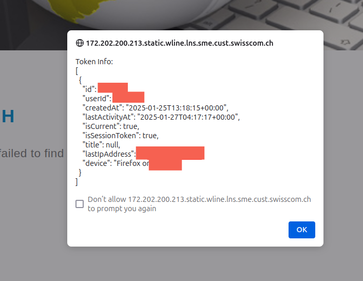
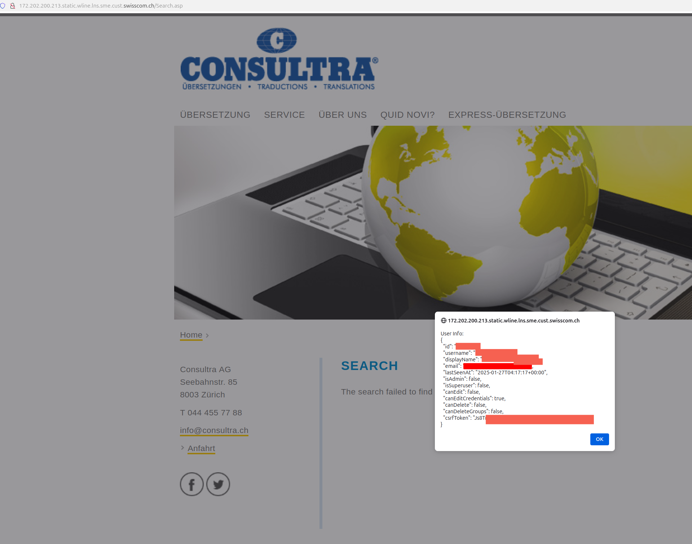
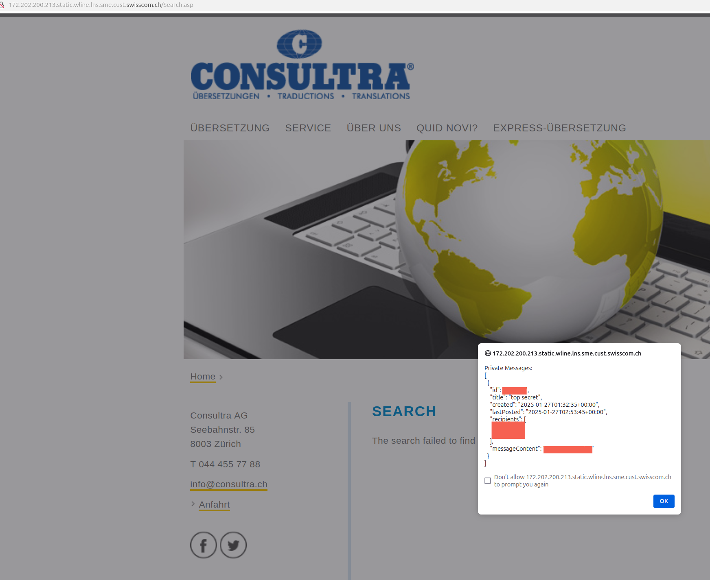

I believe this vulnerability was overlooked by many hunters for quite some time even though it was in the core scope of a well-known bug bounty program that receives hundreds of reports per month.

The issue itself is fairly simple in essence. We have a domain that reflects the value of the request's `Origin` header into the `Access-Control-Allow-Origin` response header. In addition to that, the endpoint returns the following headers:

```http
Access-Control-Allow-Origin: https://evil.com
Access-Control-Allow-Headers: Accept, Authorization, Cache-Control, Content-Type, Origin, Pragma, X-Api-Authorization, X-Cache-For, X-CSRF-Token, X-HTTP-Method-Override, X-Requested-With, Adrum, X-Add-Attributes, X-Add-Headers, X-Force-Accept-Language, X-Referer
Access-Control-Expose-Headers: Content-Length, Content-Location, Content-Range, Content-Type, Link, Last-Modified, Location, X-CSRF-Token, X-Enabled, X-Linguist-Hash
Access-Control-Allow-Credentials: true
Access-Control-Allow-Methods: GET, POST, OPTIONS, HEAD, PATCH, DELETE
```

In general, if `Access-Control-Allow-Origin` is set to a specific domain and `Access-Control-Allow-Credentials` is set to `true`, then the website trusts this domain to carry out requests on behalf of the user (the browser includes user's cookies). For detailed information about CORS, refer to [web.dev](https://web.dev/articles/cross-origin-resource-sharing) or [Portswigger](https://portswigger.net/web-security/cors)

## **Unexploitable CORS**

At first, I created a quick Proof of Concept and tested it, but unfortunately, the browser didn’t send any cookies. Why?

The answer lies in how the authentication cookies were set. I examined the endpoint responsible for setting the cookie and it had the following attributes:



The `SameSite=Lax` attribute basically means that the authentication cookie is only sent when the request originates from a same-site context, with a few exceptions:

- **Lax+POST (2-minute window when the cookie is first set)** – Not applicable here, as we are trying to exploit CORS, and the target uses CSRF tokens to protect against CSRF attacks. Additionally, the `SameSite` flag is explicitly set, preventing `Lax+POST` from working.
- **Top-level navigation** – Again, this does not help since we are trying to exploit CORS.

This is likely the point where many researchers gave up. However, there was still a way to exploit the issue - just not from an arbitrary domain. Instead, we needed access to a subdomain under the same site (`.swisscom.ch`).

Finding an XSS vulnerability would typically require giving up a bounty or spending an unknown amount of time searching for one. Instead, I focused on something every security professional loves - **out-of-scope assets**.

## **Chaining the Exploit with XSS**

Fortunately, Swisscom has customer subdomains under `.cust.swisscom.com`. With the help of Google Dork magic I identified an XSS within two minutes on the following site:

```
site:cust.swisscom.ch inurl:search
```


With this, exploitation became straightforward:

1. Get a user to visit our controlled subdomain.
2. Send a `POST` request to the vulnerable XSS endpoint.
3. Inject JavaScript via XSS to send CORS requests and extract user data.
4. Profit.

Now, we could query all available user data from the target system.



## **CSRF Exposure**

Another crucial observation: the `Access-Control-Expose-Headers` list included `X-CSRF-Token`, which meant we could retrieve the user’s CSRF token. This allowed not only data exfiltration but also **modifying data** via `POST`, `PATCH`, and `DELETE` requests. In the end if the adversary happenned to attack a user with an Admin or SuperUser role they could leverage the CSRF to perform Account Takeovers via `api/sc/set-email`.



## **A Wormable Exploit**

An interesting aspect of this platform is its **wormable properties** when it comes to client-side issues like XSS. Users on the platform could chat with each other, and through CORS and CSRF exploitation, the payload could propagate itself across accounts.



## **Final Thoughts**

Thinking beyond constraints and getting back to fundamentals is rather an important skill to hone. These approaches can lead to identifying something fairly simple lying on the surface which everyone else has overlooked.

## **Timeline**

- **27.01.2025** - Issue reported
- **29.01.2025** - Issue triaged
- **07.02.2025** - Issue fixed
- **07.02.2025** - Fix verified
- **??.??.????** - Awaiting bounty decision
