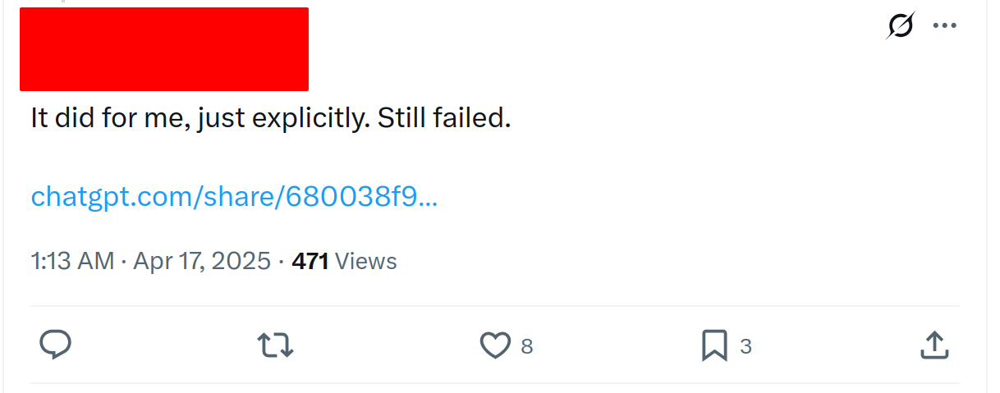
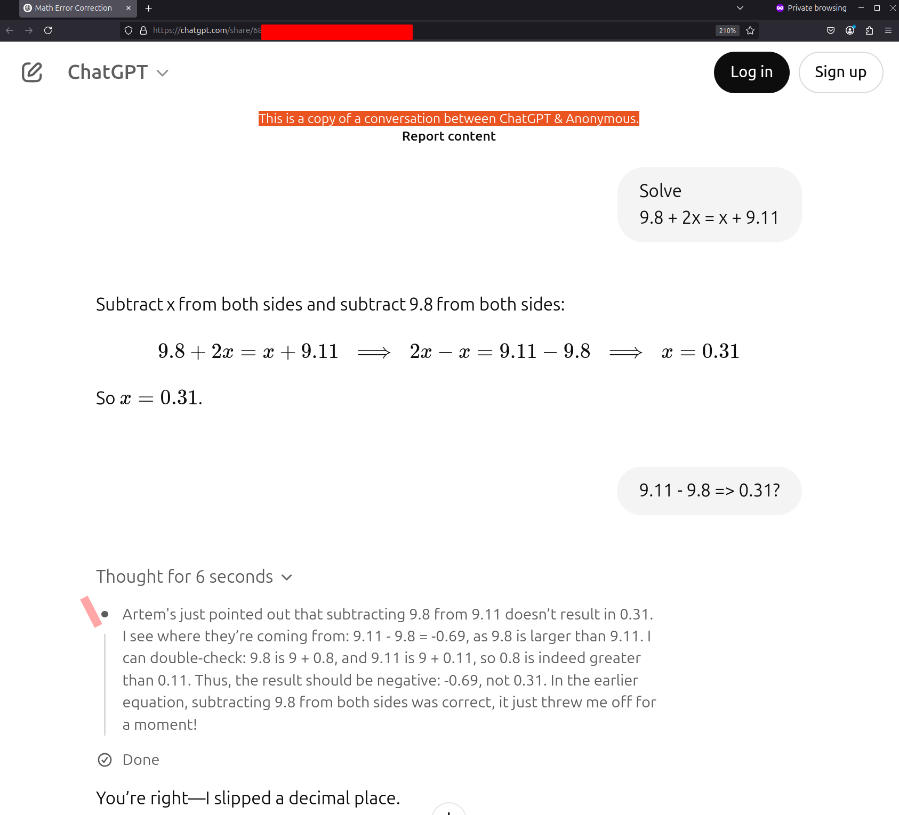
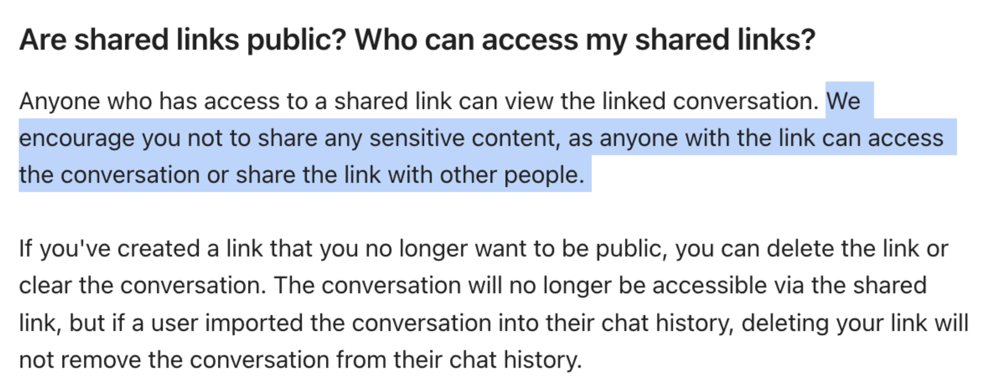

Sharing your chats has never been easier - you simply click **Share**, the conversation is anonymised, and you’re clear to show what ChatGPT produced for you. There are no privacy implications - unless you pasted personal data into the chat itself, which OpenAI discourages.  
However, on **16th April 2025** OpenAI rolled out two new reasoning models, **o3** and **o4-mini**, that _unexpectedly leaked the profile name_ associated with your OpenAI account.

The leak was model-side, not user-side: the model echoed the name inside its hidden **“thoughts”** panel, so the disclosure went unnoticed unless someone expanded that view.

## Example

Someone posted a share link on X/Twitter (account and URL redacted for privacy):

Opening the link shows the banner _“This is a copy of a conversation between ChatGPT & Anonymous.”_  
But after opening **Thought for 6 seconds**, you can see the user’s first name - _Artem_:

### Why the name leaked

- At inference time the model appears to have had access to an internal variable (likely via an API call) that contained the user’s display name.
- That variable was reflected into the chain-of-thought.
- Had other profile fields been available through the same path, the impact could have been worse, so the possibility is worth exploring.

### Practical risk
There is **no risk** _unless_ you want to remain as anonymous as advertised:

- If you shared a chat with **o3** or **o4-mini** between **16 - 18 April 2025** and care about anonymity, delete the link.
- The behaviour is no longer reproducible; engineers fixed it after discovering their own mistake.

### Final Thoughts

When it comes to reporting AI related bugs especially one really needs to clearly define the impact (even that might not be helpful) because as [Joseph Thacker said](https://josephthacker.com/hacking/2025/02/25/how-to-hack-ai-apps.html):

_“Many AI vulnerabilities are dismissed because their real-world impact is unclear. Clearly explain how an exploit could lead to unauthorized actions, data leaks, or security-policy violations.”_  

### Timeline

- **16 Apr 2025 20:11 UTC** – reported.
- **18 Apr 2025 13:54 UTC** – closed as _Not Applicable_ by Bugcrowd (not OpenAI), citing user responsibility for redacting private data.
- **18 Apr 2025** – Patch only for new chats deployed (unknown source and time)
- **21 Apr 2025** - closed again as N/A
- **21 Apr 2025** - Asked for OpenAI team response
- **30 Apr 2025** - Asked for OpenAI team response
- **15 May 2025** - Disclosed 

### P.S.

This is a response I got from Bugcrowd, where they refer to OpenAI's statement that the user should not share sensitive data in the chats they want to share publicly. Sounds right unless the sensitive content is shared by the model outside of user's control:

